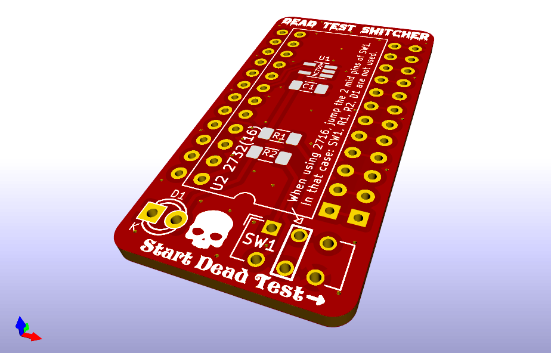

# Switcher board for Apple ][ Dead Test RAM Diagnostic ROM

I was using another Diagnoctics card, but the other day when I was repairing my Apple II Plus, I accidentally inserted it backwards. The card's microcontroller and ROM were fried...Then I found out about this project and tried it right away and it was really great!  I used a 2KB ROM with the Apple II Plus F8, but I redesigned the PCB so that I could switch between the autostart monitor ROM and the 4KB ROM.  

The prototype worked fine, but I will upload everything once the PCB is completed.

  

