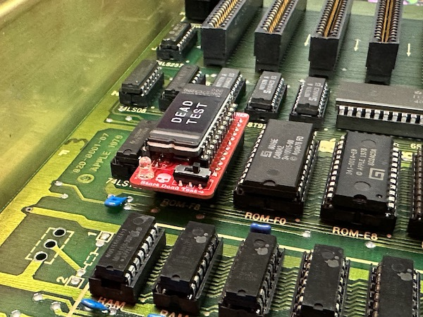
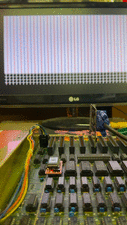
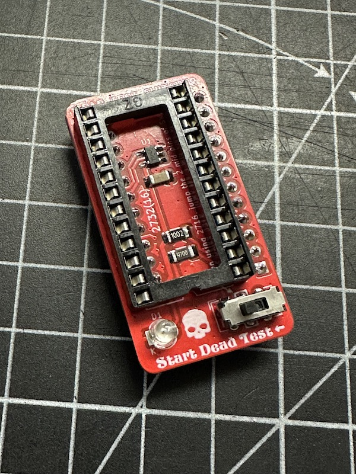
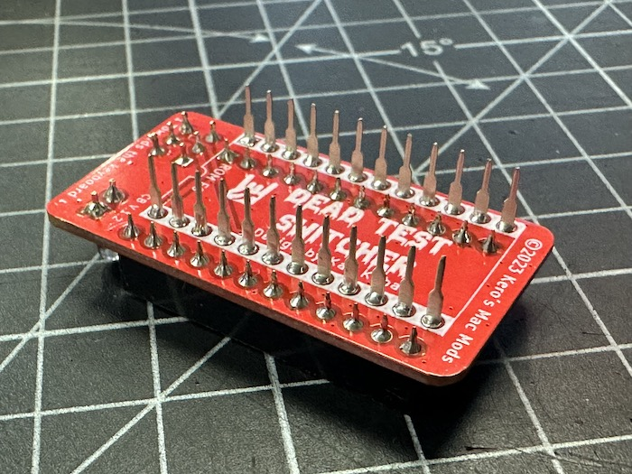
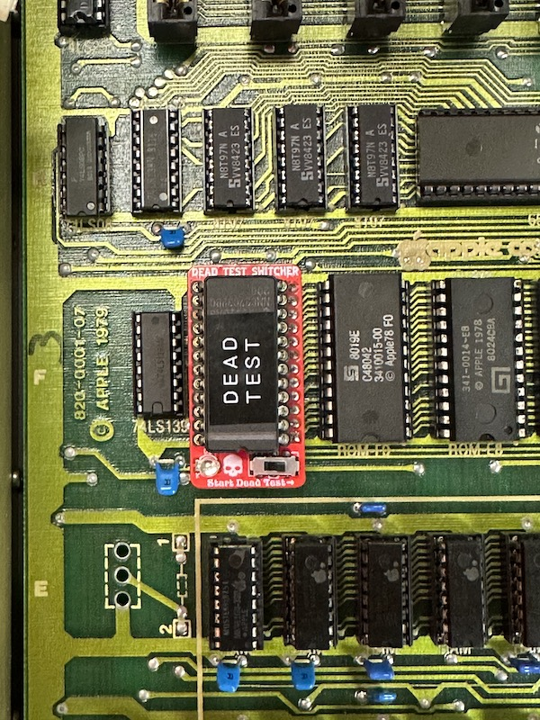
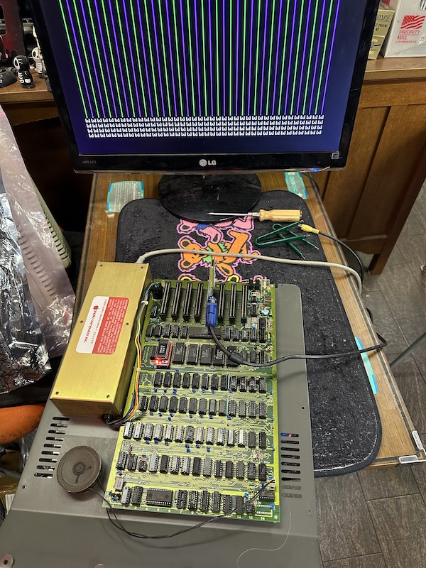

# Switcher board for Apple II Dead Test RAM Diagnostic ROM

 
  
I was using another Diagnoctics card, but the other day when I was repairing my Apple II Plus, I accidentally inserted it backwards. The card's microcontroller and ROM were fried...Then I found out about this project and tried it right away and it was really great!  I used a 2KB ROM with the Apple II Plus F8, but I redesigned the PCB so that I could switch between the autostart monitor ROM and the 4KB ROM.  

  

The prototype worked fine, if you are in the process of trying to repair your Apple II, I highly recommend this as it allows you to see the logic in action. Adrian's Dead Test ROM doesn't work even after flashing to the 2716. Because Apple II uses 2316 and is not compatible unless one of the signals is inverted. For this reason, all we need is a minimum 1-in-1-out inverter, so this board using the NC7S04M5X. You can use 2716 instead of 2316 just by using this board! But that alone is not interesting, so I used 2732 and made it possible to switch between the normal auto start monitor and Dead test by switching. The recombined ROMs are [here](DeadTestSW_ROMS). 

  
  

- Uses 2732 EPROM. In this case, 2 ROMs can be switched between pull up and pull down. 
- Uses 2716 EPROM. Connect the middle two of the 6p switch and use no parts other than the EPROM, inverter, and capacitor. In this case, it can be used for repairs as a substitute for ROM from D0 to F0. 
- Of course, when 2716 is installed on the Dead test switcher board, it is compatible with ROMs from ROM-D0 to ROM-F8. 
  

## Usage
Slide switch 
Right: Normal auto start screen 
Left: Start Dead Test 

### About dead test ROM results
[Here](https://github.com/misterblack1/appleII_deadtest?tab=readme-ov-file#interpreting-the-result-display-grid)'s a table to help you with binary conversion to determine which RAM is bad.   *Also, teaching binary conversion through chatting or something are difficult and troublesome. I think you can pass if it is beyond your understanding.

## Schematics

[Here](Dead_Test_Switcher_1.1a.pdf) is the schematic I drew

## Gerber

Please use the files in the [DTS_GERBER](DTS_GERBER) folder. We have confirmed that you can order directly from JLCPCB.  
BOM is [here](DTS11.xlsx).  
- U1: SOT23-5 [NC7S04M5X](https://www.digikey.jp/en/products/detail/onsemi/NC7S04M5X-L22090/16910805)
- U2, U3: 24P Pin header and IC socket. Use what you like. U2's EPROM is 2732, but if you want to use 2716, it will be 2K, and switches and LEDs cannot be used. Connect the middle 2 pins of the switch.
- SW1: DPDT Slide Switch 2.54p 6pin, can be replaced with 2.54mm pitch jumper pins.
- R1: 1206 Resistor 10K ohms
- R2: 1206 Resistor 470 ohms
- C1: 1206 Capacitor 100nF

## Licence

Dead Test Switcher PCB is licensed under CC BY-NC-SA 4.0. Permitted for personal use, but not for sale. 
Dead Test ROM is licensed by [Adrian's Digital Basement](https://adriansbasement.com). Follow it under his control. 

